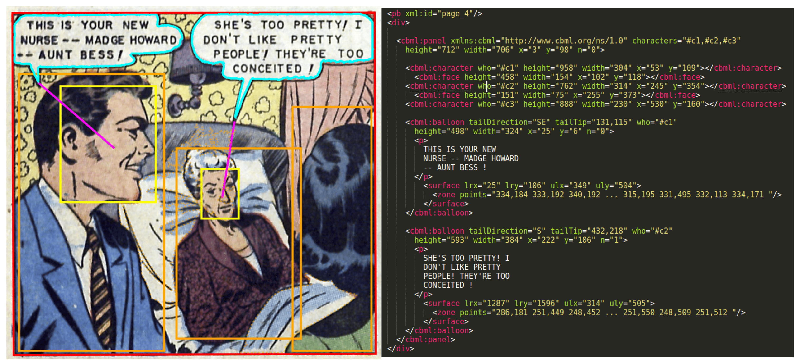

# Comic Analysis Toolkit

This repository provides a comprehensive pipeline for detecting and analyzing elements of digital comics, including panels, speech balloons, texts, comic characters, and their relationships. The extracted data can be indexed in structured formats like Comic Book Markup Language (CBML) to enable advanced search and retrieval functionalities.

---

## Features
- **Panel Detection**: Identifies individual panels on comic pages.
- **Balloon Detection and Segmentation**: Locates and segments speech balloons, including complex shapes.
- **Text Detection and Recognition**: Extracts text from balloons and panels, adaptable to various handwriting styles.
- **Character and Face Detection**: Detects comic characters and their faces, accounting for diverse styles and designs.
- **Relation Analysis**: Establishes relationships between detected elements, such as balloon-to-character associations and reading order.
- **CBML Indexing**: Encodes extracted data into a searchable XML-like format for efficient retrieval.

---

## Steps to Rebuild the System

### Step 1: Define the Scope
1. **Objective**: Determine the specific features to detect (e.g., panels, characters, texts).
2. **Dataset**: Collect and annotate datasets of comic images. Example datasets include:
   - eBDtheque
   - Digital Comic Museum (DCM772)
   - Fahad18 for cartoon character detection
3. **Output**: Define the format for indexed results, such as CBML.

### Step 2: Set Up Your Development Environment
1. **Programming Language**: Python
2. **Frameworks**:
   - **Deep Learning**: TensorFlow, PyTorch
   - **Object Detection Models**: YOLOv5, Faster R-CNN, SSD
   - **OCR**: Tesseract, EasyOCR
3. **Tools**:
   - **Annotation**: LabelImg, VGG Image Annotator
   - **Visualization**: OpenCV
4. **Version Control**: Use Git and host the repository on GitHub.

### Step 3: Build the Detection Pipeline
#### 1. **Panel Detection**
   - Train an object detection model (e.g., YOLOv5) with annotated panel data.
   - Fine-tune the model using transfer learning with pre-trained weights.

#### 2. **Balloon Detection and Segmentation**
   - Use segmentation models like DeepLab or Mask R-CNN.
   - Refine results using a hybrid approach combining deep learning and traditional methods.

#### 3. **Text Detection and Recognition**
   - Detect text regions using models like EAST or DBNet.
   - Recognize text using OCR engines like Tesseract, fine-tuned for comic fonts.
   - Apply a two-stage training process for handwriting adaptation.

#### 4. **Character and Face Detection**
   - Train detection models to locate characters and faces.
   - Fine-tune models with dataset-specific features and bounding box dimensions.

#### 5. **Relation Analysis**
   - Use geometric algorithms to infer relationships, such as:
     - **Balloon-to-character**: Based on tail direction.
     - **Reading order**: Derived from layout analysis.

### Step 4: Data Preprocessing and Augmentation
1. Apply techniques like cropping, scaling, rotation, and color jittering.
2. Normalize image sizes and annotation formats.

### Step 5: Model Training and Validation
1. Split data into training, validation, and testing subsets.
2. Train each detection model independently:
   - Panel detection
   - Balloon segmentation
   - Character and face detection
3. Evaluate performance using metrics like IoU, F1-score, or mAP.

### Step 6: Integration and Indexing
1. Combine detection outputs and encode them into CBML or other structured formats.

### Step 7: Visualization and Testing
1. Use OpenCV or Matplotlib for overlaying detection results on images.
2. Test the system on new comic images.

### Step 8: Iteration and Improvement
1. Fine-tune models based on errors or new data.
2. Experiment with additional features like style classification.

### Step 9: Deployment
1. Package the system as a standalone tool or API.
2. Optionally, build a GUI using PyQt or Tkinter.

---

## Repository Structure
```plaintext
.
├── data
│   ├── raw        # Raw comic images
│   ├── annotated  # Annotated datasets
│   └── models     # Pre-trained and fine-tuned models
├── src
│   ├── detection  # Scripts for panel, balloon, text, character detection
│   ├── training   # Model training and validation scripts
│   ├── analysis   # Relation analysis and indexing
│   └── utils      # Helper functions
├── notebooks      # Jupyter notebooks for experimentation
├── docs           # Documentation files
└── README.md      # This file
```

---

## Getting Started

### Prerequisites
- Python 3.8+
- TensorFlow or PyTorch
- OpenCV
- Tesseract OCR

### Installation
1. Clone the repository:
   ```bash
   git clone https://github.com/YanisMediene/comic-analysis-toolkit.git
   cd comic-analysis-toolkit
   ```
2. Install dependencies:
   ```bash
   pip install -r requirements.txt
   ```

### Usage
1. Prepare and annotate your dataset.
2. Train detection models using provided scripts in `src/training`.
3. Run the pipeline to detect and analyze comics:
   ```bash
   python src/main.py --input data/raw --output results
   ```

### Example Results


---

## Contributing
Contributions are welcome! Please open issues or submit pull requests for improvements.

---

## License
This project is licensed under the MIT License.
